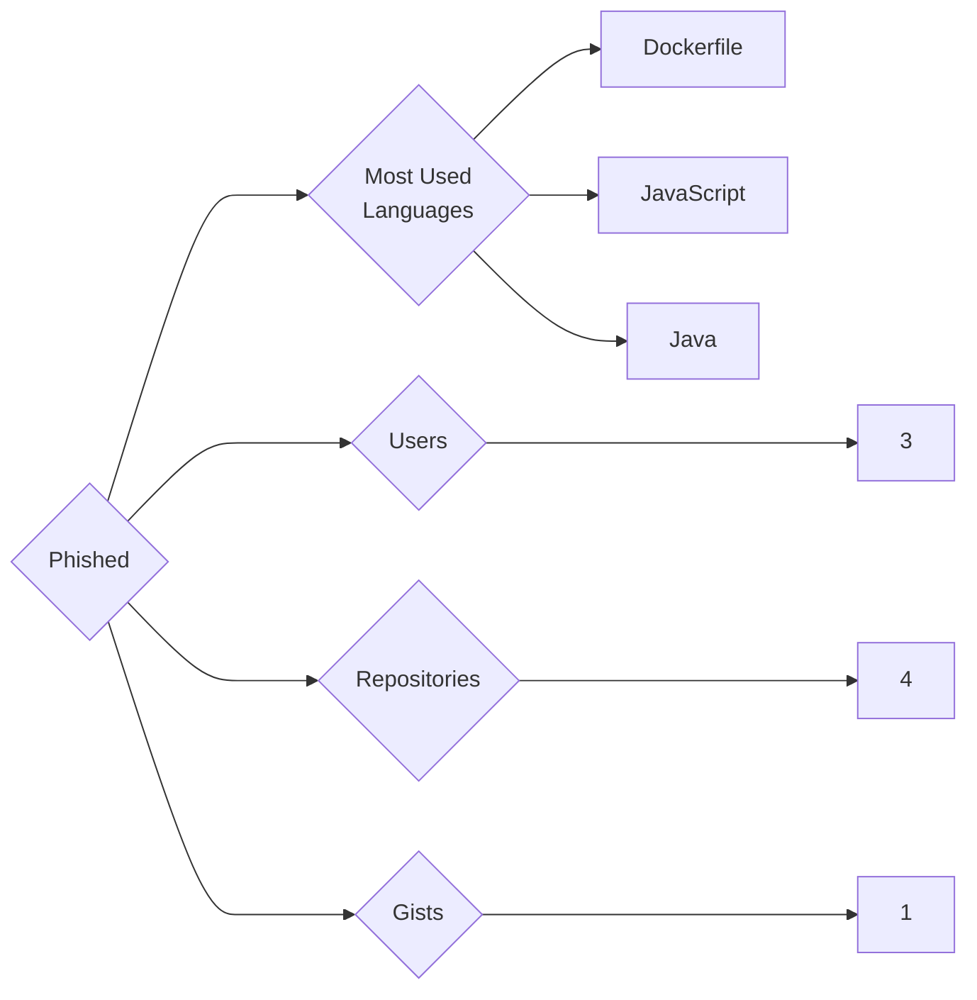

<h1 align="center">Phished</h1>

```mermaid
graph LR
COMPANY_NAME{Phished}
COMPANY_NAME ---> U{Users} ---> UN[3]
COMPANY_NAME ---> R{Repositories} ---> RN[4]
COMPANY_NAME ---> G{Gists} ---> GN[1]
COMPANY_NAME ---> ML{Most Used<br>Languages}
ML --> Dockerfile[Dockerfile]
ML --> JavaScript[JavaScript]
ML --> Java[Java]
```
