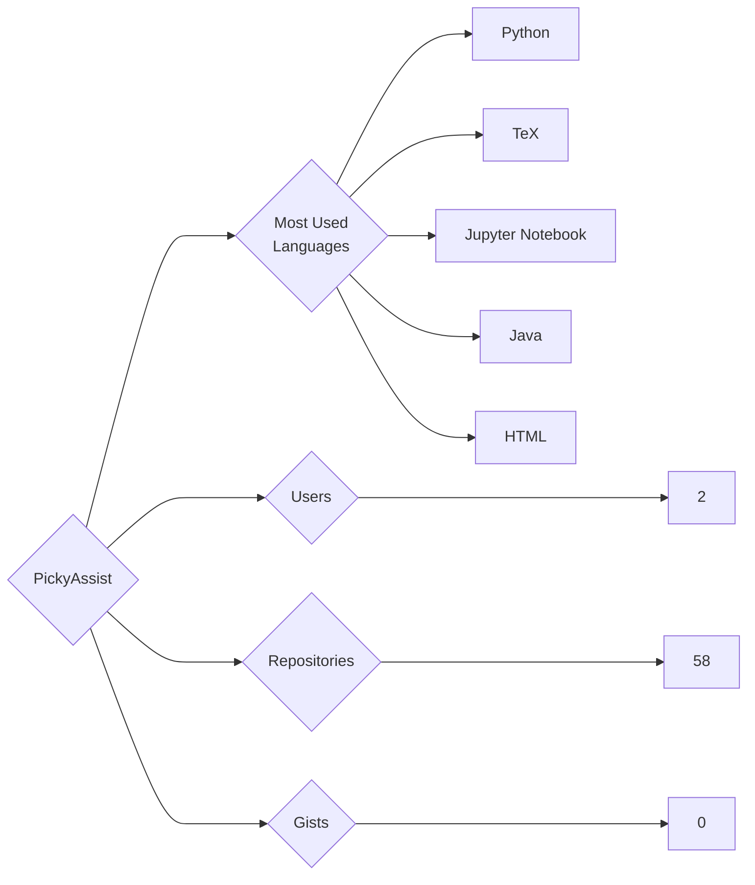

<h1 align="center">PickyAssist</h1>

```mermaid
graph LR
COMPANY_NAME{PickyAssist}
COMPANY_NAME ---> U{Users} ---> UN[2]
COMPANY_NAME ---> R{Repositories} ---> RN[58]
COMPANY_NAME ---> G{Gists} ---> GN[0]
COMPANY_NAME ---> ML{Most Used<br>Languages}
ML --> Python[Python]
ML --> TeX[TeX]
ML --> Jupyter_Notebook[Jupyter Notebook]
ML --> Java[Java]
ML --> HTML[HTML]
```
