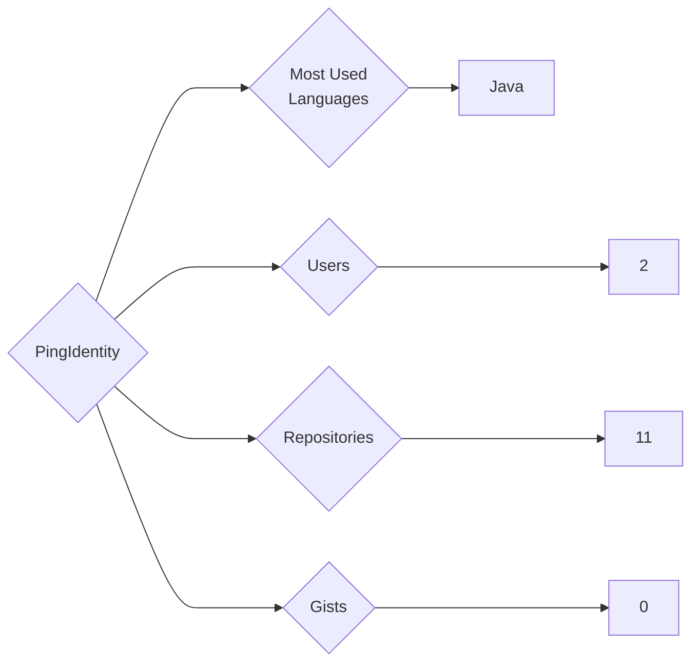

<h1 align="center">PingIdentity</h1>

```mermaid
graph LR
COMPANY_NAME{PingIdentity}
COMPANY_NAME ---> U{Users} ---> UN[2]
COMPANY_NAME ---> R{Repositories} ---> RN[11]
COMPANY_NAME ---> G{Gists} ---> GN[0]
COMPANY_NAME ---> ML{Most Used<br>Languages}
ML --> Java[Java]
```
