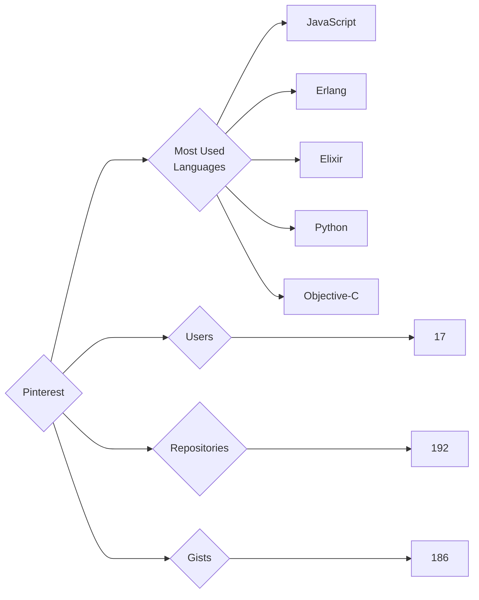

<h1 align="center">Pinterest</h1>

```mermaid
graph LR
COMPANY_NAME{Pinterest}
COMPANY_NAME ---> U{Users} ---> UN[17]
COMPANY_NAME ---> R{Repositories} ---> RN[192]
COMPANY_NAME ---> G{Gists} ---> GN[186]
COMPANY_NAME ---> ML{Most Used<br>Languages}
ML --> JavaScript[JavaScript]
ML --> Erlang[Erlang]
ML --> Elixir[Elixir]
ML --> Python[Python]
ML --> Objective-C[Objective-C]
```
