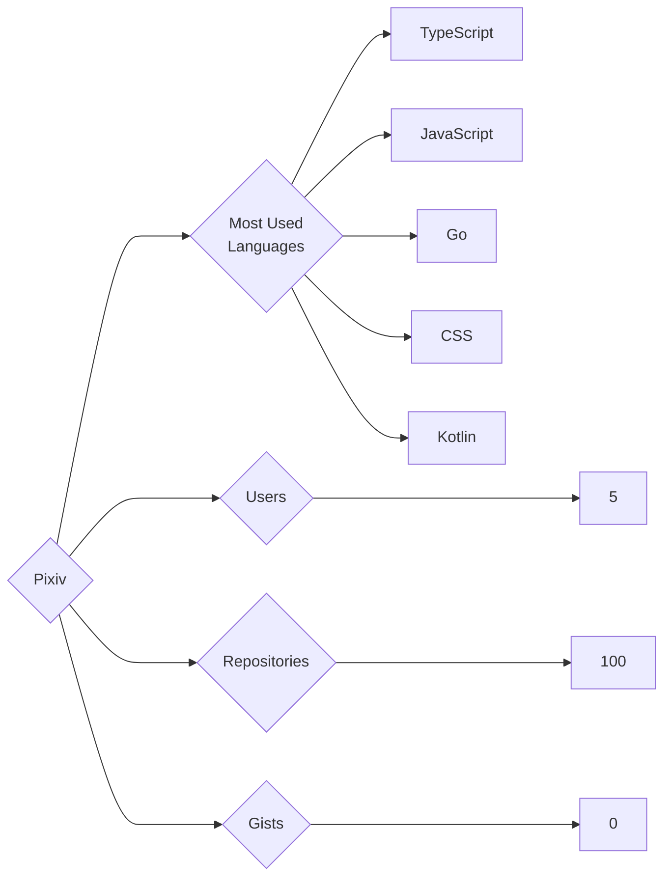

<h1 align="center">Pixiv</h1>

```mermaid
graph LR
COMPANY_NAME{Pixiv}
COMPANY_NAME ---> U{Users} ---> UN[5]
COMPANY_NAME ---> R{Repositories} ---> RN[100]
COMPANY_NAME ---> G{Gists} ---> GN[0]
COMPANY_NAME ---> ML{Most Used<br>Languages}
ML --> TypeScript
ML --> JavaScript
ML --> Go
ML --> CSS
ML --> Kotlin
```
