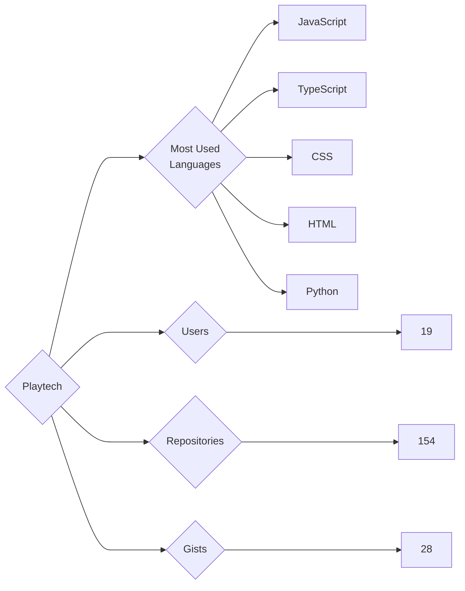

<h1 align="center">Playtech</h1>

```mermaid
graph LR
COMPANY_NAME{Playtech}
COMPANY_NAME ---> U{Users} ---> UN[19]
COMPANY_NAME ---> R{Repositories} ---> RN[154]
COMPANY_NAME ---> G{Gists} ---> GN[28]
COMPANY_NAME ---> ML{Most Used<br>Languages}
ML --> JavaScript[JavaScript]
ML --> TypeScript[TypeScript]
ML --> CSS[CSS]
ML --> HTML[HTML]
ML --> Python[Python]
```
