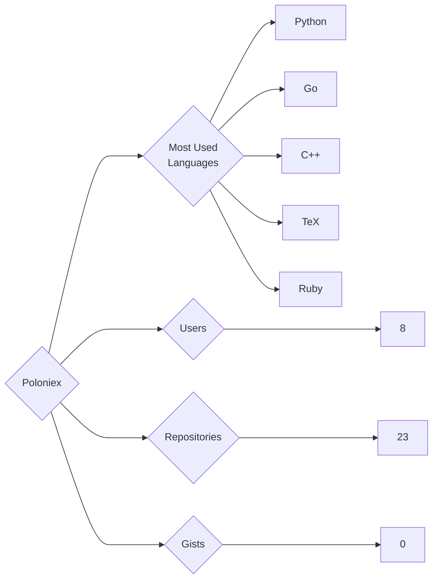

<h1 align="center">Poloniex</h1>

```mermaid
graph LR
COMPANY_NAME{Poloniex}
COMPANY_NAME ---> U{Users} ---> UN[8]
COMPANY_NAME ---> R{Repositories} ---> RN[23]
COMPANY_NAME ---> G{Gists} ---> GN[0]
COMPANY_NAME ---> ML{Most Used<br>Languages}
ML --> Python[Python]
ML --> Go[Go]
ML --> C++[C++]
ML --> TeX[TeX]
ML --> Ruby[Ruby]
```
