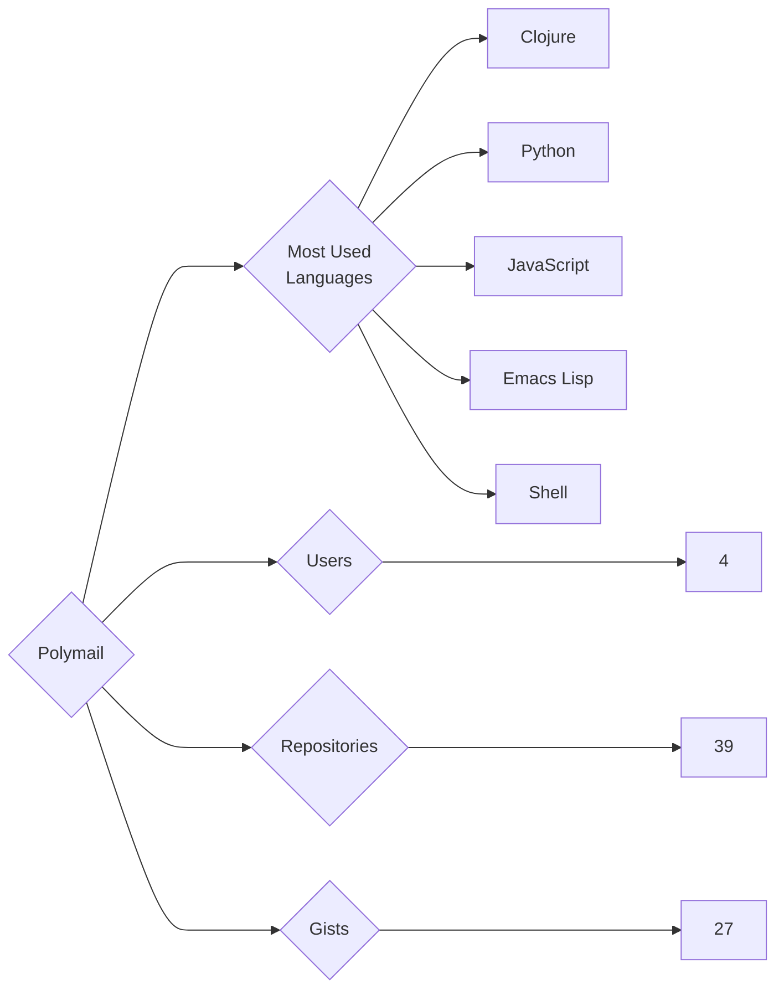

<h1 align="center">Polymail</h1>

```mermaid
graph LR
COMPANY_NAME{Polymail}
COMPANY_NAME ---> U{Users} ---> UN[4]
COMPANY_NAME ---> R{Repositories} ---> RN[39]
COMPANY_NAME ---> G{Gists} ---> GN[27]
COMPANY_NAME ---> ML{Most Used<br>Languages}
ML --> Clojure[Clojure]
ML --> Python[Python]
ML --> JavaScript[JavaScript]
ML --> Emacs_Lisp[Emacs Lisp]
ML --> Shell[Shell]
```
