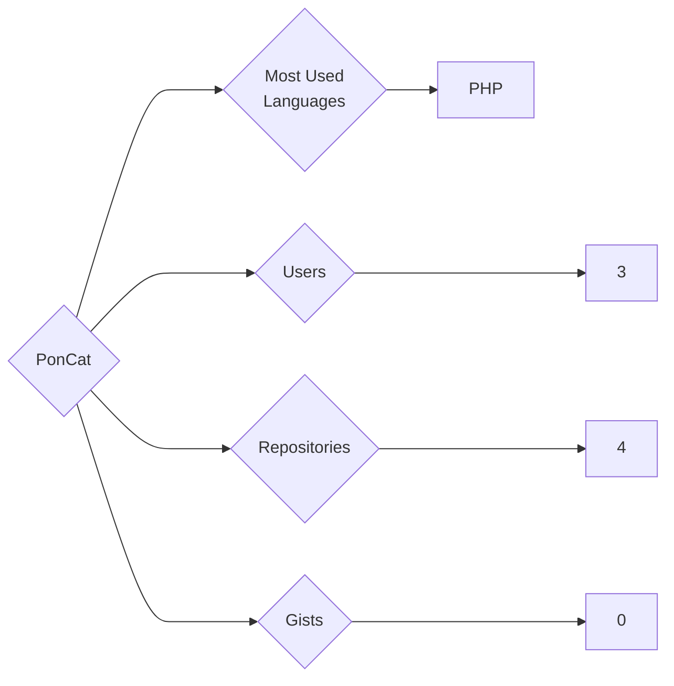

<h1 align="center">PonCat</h1>

```mermaid
graph LR
COMPANY_NAME{PonCat}
COMPANY_NAME ---> U{Users} ---> UN[3]
COMPANY_NAME ---> R{Repositories} ---> RN[4]
COMPANY_NAME ---> G{Gists} ---> GN[0]
COMPANY_NAME ---> ML{Most Used<br>Languages}
ML --> PHP[PHP]
```
