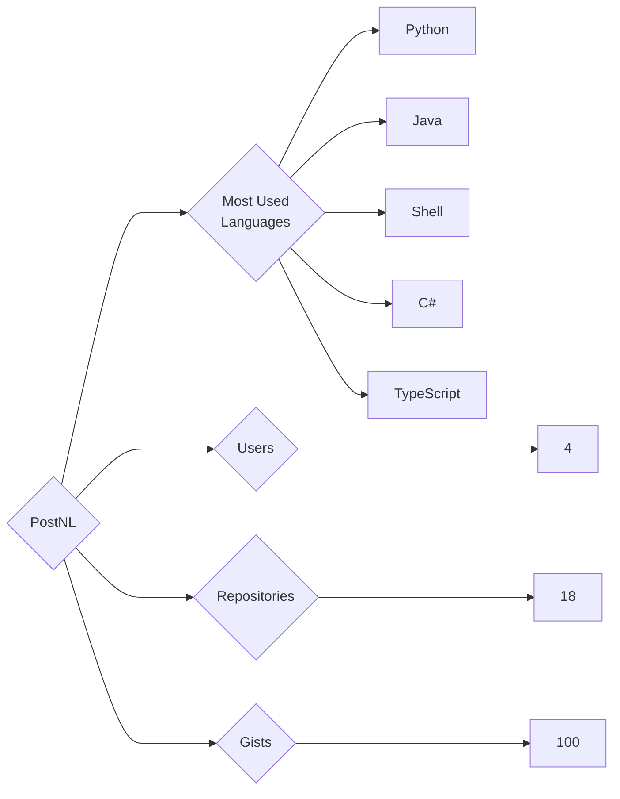

<h1 align="center">PostNL</h1>

```mermaid
graph LR
COMPANY_NAME{PostNL}
COMPANY_NAME ---> U{Users} ---> UN[4]
COMPANY_NAME ---> R{Repositories} ---> RN[18]
COMPANY_NAME ---> G{Gists} ---> GN[100]
COMPANY_NAME ---> ML{Most Used<br>Languages}
ML --> Python[Python]
ML --> Java[Java]
ML --> Shell[Shell]
ML --> C#[C#]
ML --> TypeScript[TypeScript]
```
