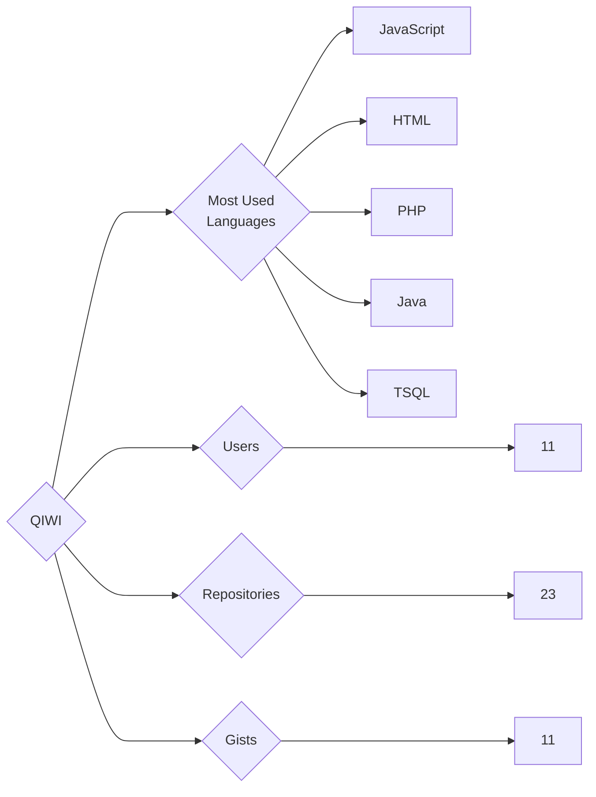

<h1 align="center">QIWI</h1>

```mermaid
graph LR
COMPANY_NAME{QIWI}
COMPANY_NAME ---> U{Users} ---> UN[11]
COMPANY_NAME ---> R{Repositories} ---> RN[23]
COMPANY_NAME ---> G{Gists} ---> GN[11]
COMPANY_NAME ---> ML{Most Used<br>Languages}
ML --> JavaScript[JavaScript]
ML --> HTML[HTML]
ML --> PHP[PHP]
ML --> Java[Java]
ML --> TSQL[TSQL]
```
