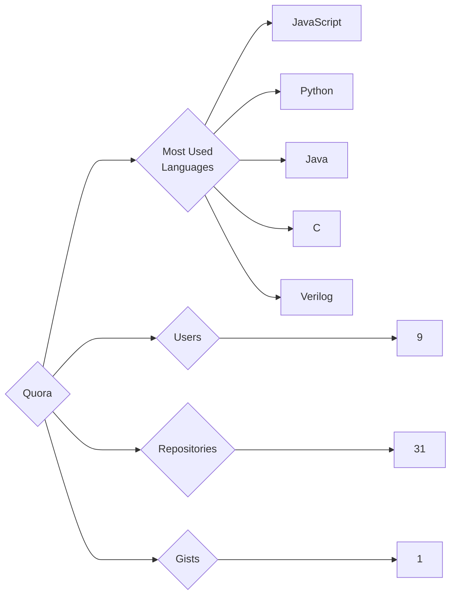

<h1 align="center">Quora</h1>

```mermaid
graph LR
COMPANY_NAME{Quora}
COMPANY_NAME ---> U{Users} ---> UN[9]
COMPANY_NAME ---> R{Repositories} ---> RN[31]
COMPANY_NAME ---> G{Gists} ---> GN[1]
COMPANY_NAME ---> ML{Most Used<br>Languages}
ML --> JavaScript[JavaScript]
ML --> Python[Python]
ML --> Java[Java]
ML --> C[C]
ML --> Verilog[Verilog]
```
