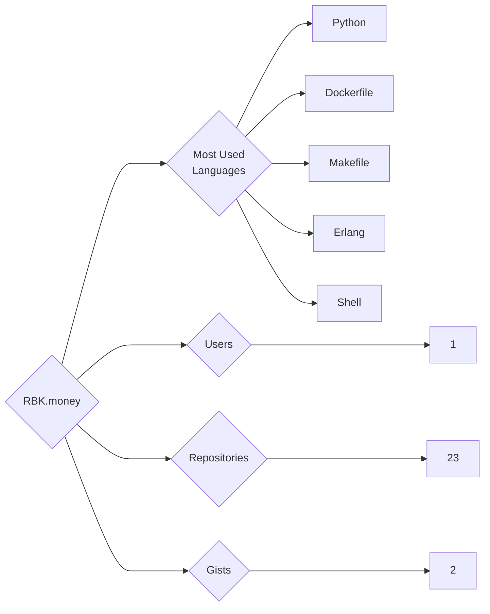

<h1 align="center">RBK.money</h1>

```mermaid
graph LR
COMPANY_NAME{RBK.money}
COMPANY_NAME ---> U{Users} ---> UN[1]
COMPANY_NAME ---> R{Repositories} ---> RN[23]
COMPANY_NAME ---> G{Gists} ---> GN[2]
COMPANY_NAME ---> ML{Most Used<br>Languages}
ML --> Python[Python]
ML --> Dockerfile[Dockerfile]
ML --> Makefile[Makefile]
ML --> Erlang[Erlang]
ML --> Shell[Shell]
```
