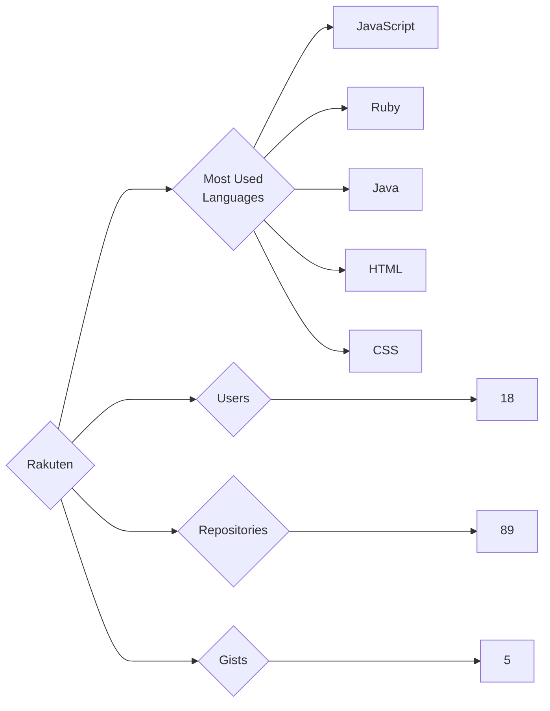

<h1 align="center">Rakuten</h1>

```mermaid
graph LR
COMPANY_NAME{Rakuten}
COMPANY_NAME ---> U{Users} ---> UN[18]
COMPANY_NAME ---> R{Repositories} ---> RN[89]
COMPANY_NAME ---> G{Gists} ---> GN[5]
COMPANY_NAME ---> ML{Most Used<br>Languages}
ML --> JavaScript[JavaScript]
ML --> Ruby[Ruby]
ML --> Java[Java]
ML --> HTML[HTML]
ML --> CSS[CSS]
```
