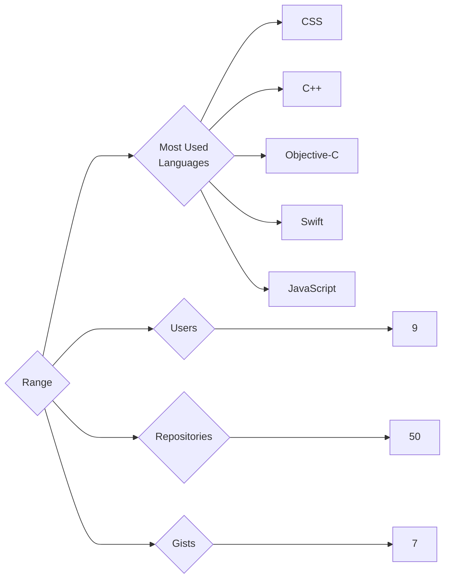

<h1 align="center">Range</h1>

```mermaid
graph LR
COMPANY_NAME{Range}
COMPANY_NAME ---> U{Users} ---> UN[9]
COMPANY_NAME ---> R{Repositories} ---> RN[50]
COMPANY_NAME ---> G{Gists} ---> GN[7]
COMPANY_NAME ---> ML{Most Used<br>Languages}
ML --> CSS[CSS]
ML --> C++[C++]
ML --> Objective-C[Objective-C]
ML --> Swift[Swift]
ML --> JavaScript[JavaScript]
```
