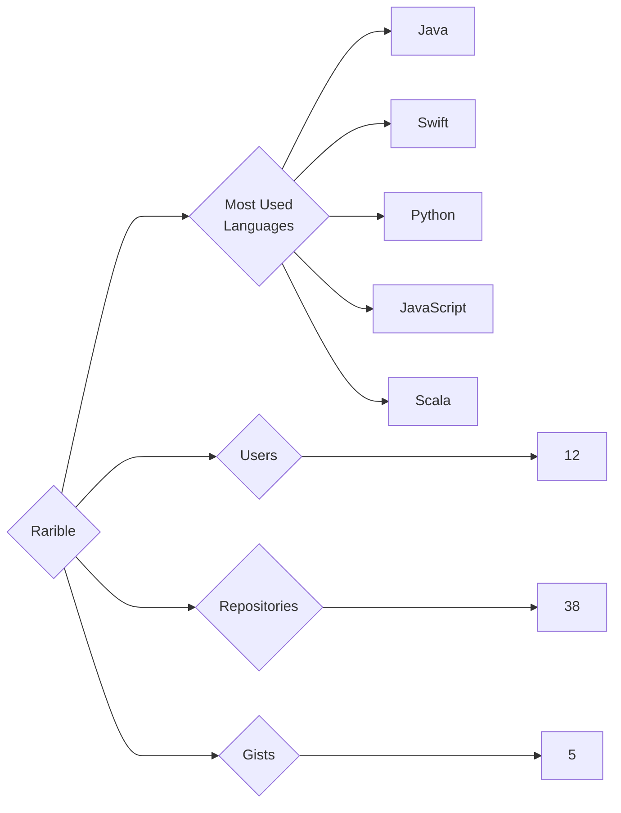

<h1 align="center">Rarible</h1>

```mermaid
graph LR
COMPANY_NAME{Rarible}
COMPANY_NAME ---> U{Users} ---> UN[12]
COMPANY_NAME ---> R{Repositories} ---> RN[38]
COMPANY_NAME ---> G{Gists} ---> GN[5]
COMPANY_NAME ---> ML{Most Used<br>Languages}
ML --> Java[Java]
ML --> Swift[Swift]
ML --> Python[Python]
ML --> JavaScript[JavaScript]
ML --> Scala[Scala]
```
