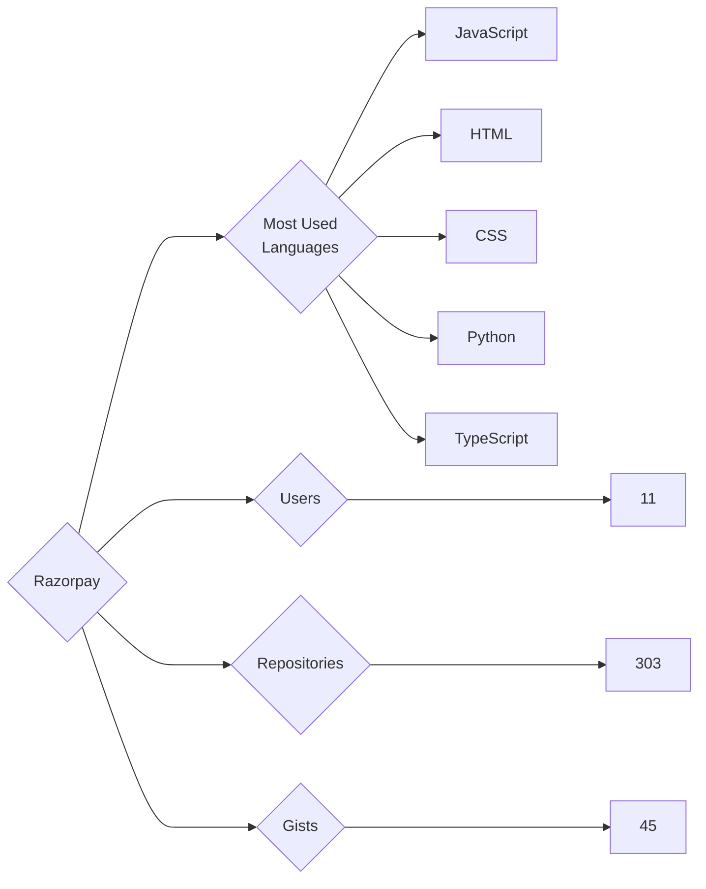

<h1 align="center">Razorpay</h1>

```mermaid
graph LR
COMPANY_NAME{Razorpay}
COMPANY_NAME ---> U{Users} ---> UN[11]
COMPANY_NAME ---> R{Repositories} ---> RN[303]
COMPANY_NAME ---> G{Gists} ---> GN[45]
COMPANY_NAME ---> ML{Most Used<br>Languages}
ML --> JavaScript[JavaScript]
ML --> HTML[HTML]
ML --> CSS[CSS]
ML --> Python[Python]
ML --> TypeScript[TypeScript]
```
