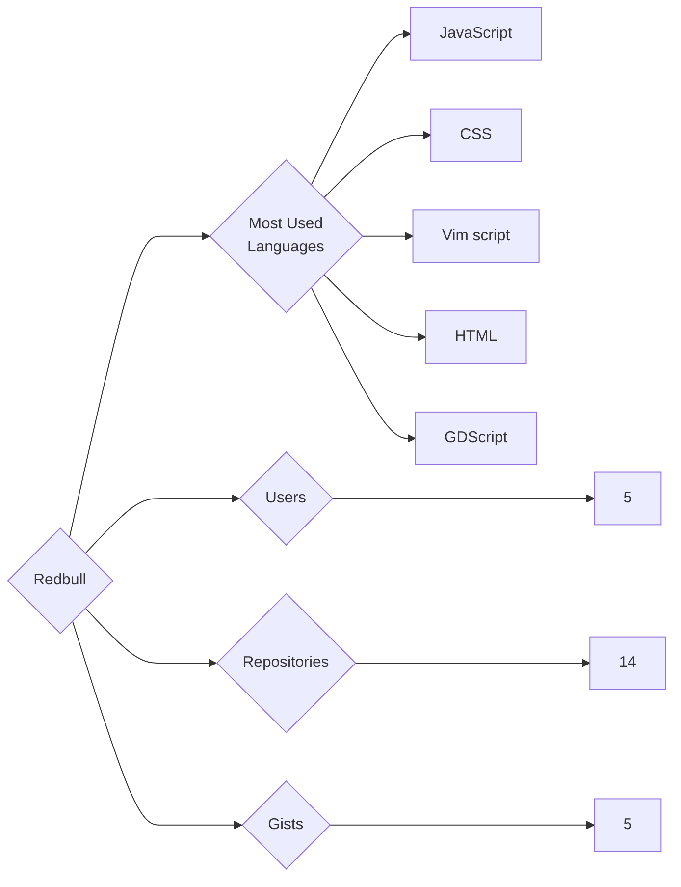

<h1 align="center">Redbull</h1>

```mermaid
graph LR
COMPANY_NAME{Redbull}
COMPANY_NAME ---> U{Users} ---> UN[5]
COMPANY_NAME ---> R{Repositories} ---> RN[14]
COMPANY_NAME ---> G{Gists} ---> GN[5]
COMPANY_NAME ---> ML{Most Used<br>Languages}
ML --> JavaScript[JavaScript]
ML --> CSS[CSS]
ML --> Vim_script[Vim script]
ML --> HTML[HTML]
ML --> GDScript[GDScript]
```
