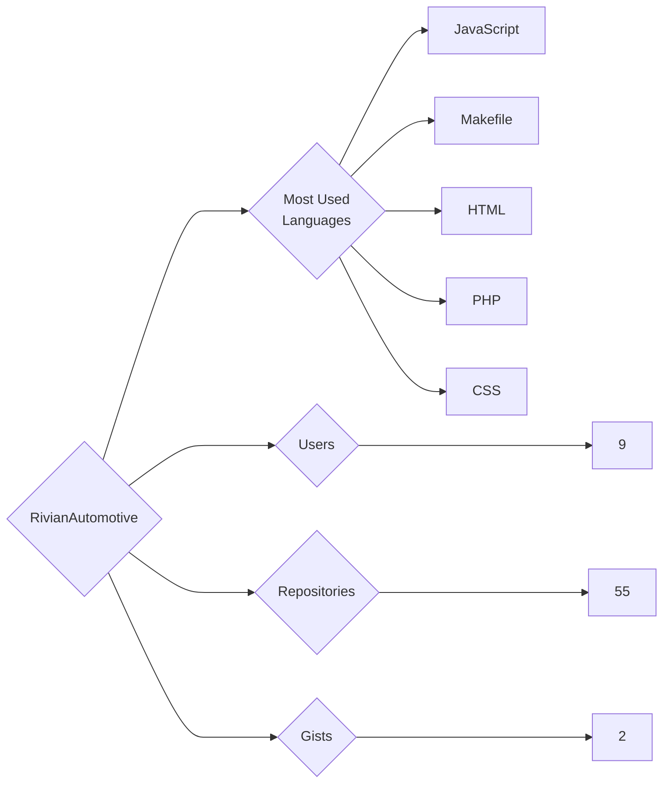

<h1 align="center">RivianAutomotive</h1>

```mermaid
graph LR
COMPANY_NAME{RivianAutomotive}
COMPANY_NAME ---> U{Users} ---> UN[9]
COMPANY_NAME ---> R{Repositories} ---> RN[55]
COMPANY_NAME ---> G{Gists} ---> GN[2]
COMPANY_NAME ---> ML{Most Used<br>Languages}
ML --> JavaScript[JavaScript]
ML --> Makefile[Makefile]
ML --> HTML[HTML]
ML --> PHP[PHP]
ML --> CSS[CSS]
```
