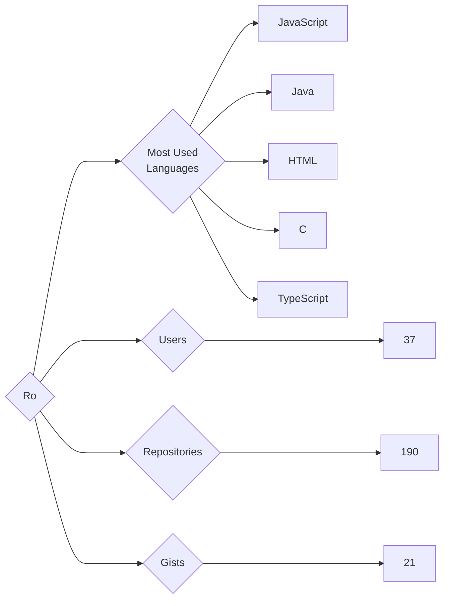

<h1 align="center">Ro</h1>

```mermaid
graph LR
COMPANY_NAME{Ro}
COMPANY_NAME ---> U{Users} ---> UN[37]
COMPANY_NAME ---> R{Repositories} ---> RN[190]
COMPANY_NAME ---> G{Gists} ---> GN[21]
COMPANY_NAME ---> ML{Most Used<br>Languages}
ML --> JavaScript[JavaScript]
ML --> Java[Java]
ML --> HTML[HTML]
ML --> C[C]
ML --> TypeScript[TypeScript]
```
