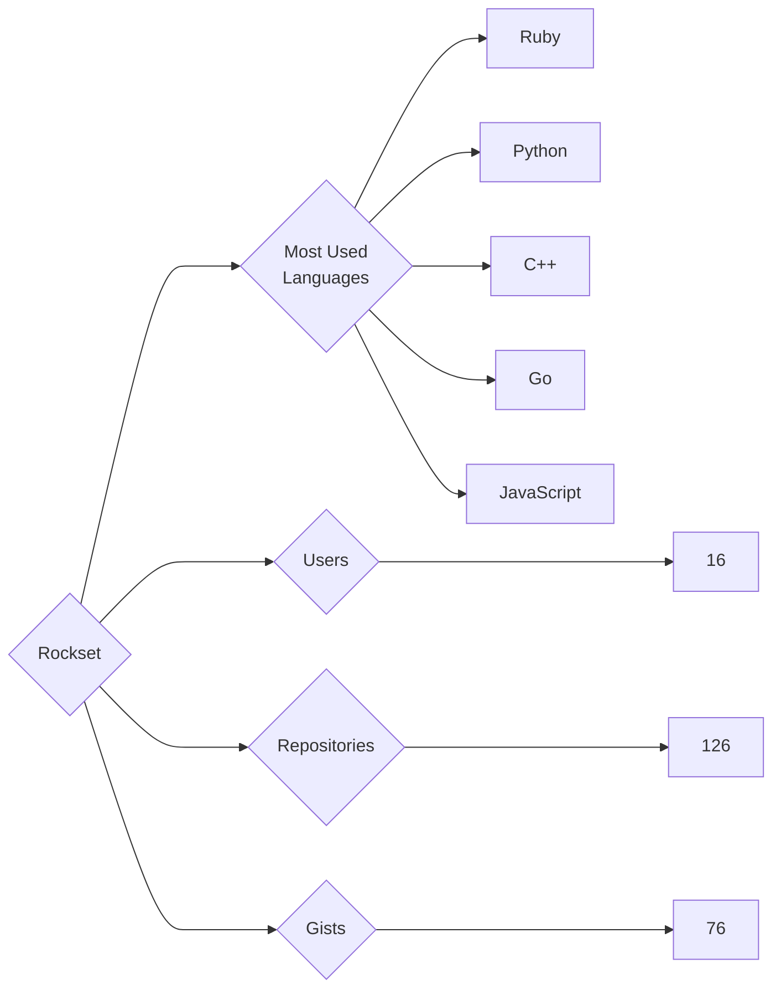

<h1 align="center">Rockset</h1>

```mermaid
graph LR
COMPANY_NAME{Rockset}
COMPANY_NAME ---> U{Users} ---> UN[16]
COMPANY_NAME ---> R{Repositories} ---> RN[126]
COMPANY_NAME ---> G{Gists} ---> GN[76]
COMPANY_NAME ---> ML{Most Used<br>Languages}
ML --> Ruby[Ruby]
ML --> Python[Python]
ML --> C++[C++]
ML --> Go[Go]
ML --> JavaScript[JavaScript]
```
