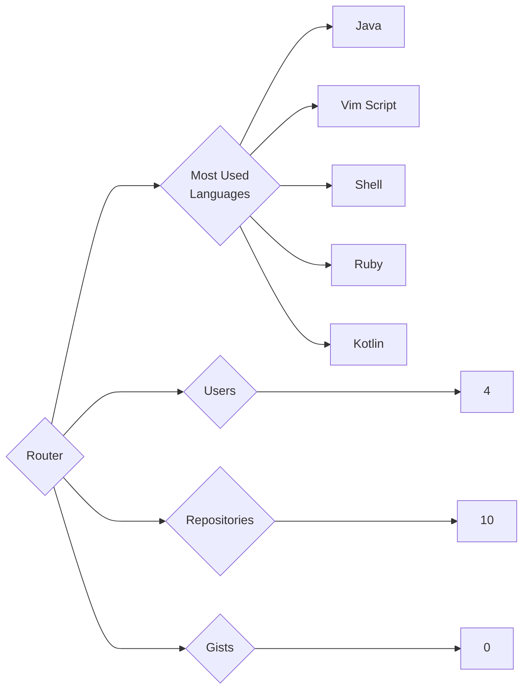

<h1 align="center">Router</h1>

```mermaid
graph LR
COMPANY_NAME{Router}
COMPANY_NAME ---> U{Users} ---> UN[4]
COMPANY_NAME ---> R{Repositories} ---> RN[10]
COMPANY_NAME ---> G{Gists} ---> GN[0]
COMPANY_NAME ---> ML{Most Used<br>Languages}
ML --> Java[Java]
ML --> Vim_Script[Vim Script]
ML --> Shell[Shell]
ML --> Ruby[Ruby]
ML --> Kotlin[Kotlin]
```
