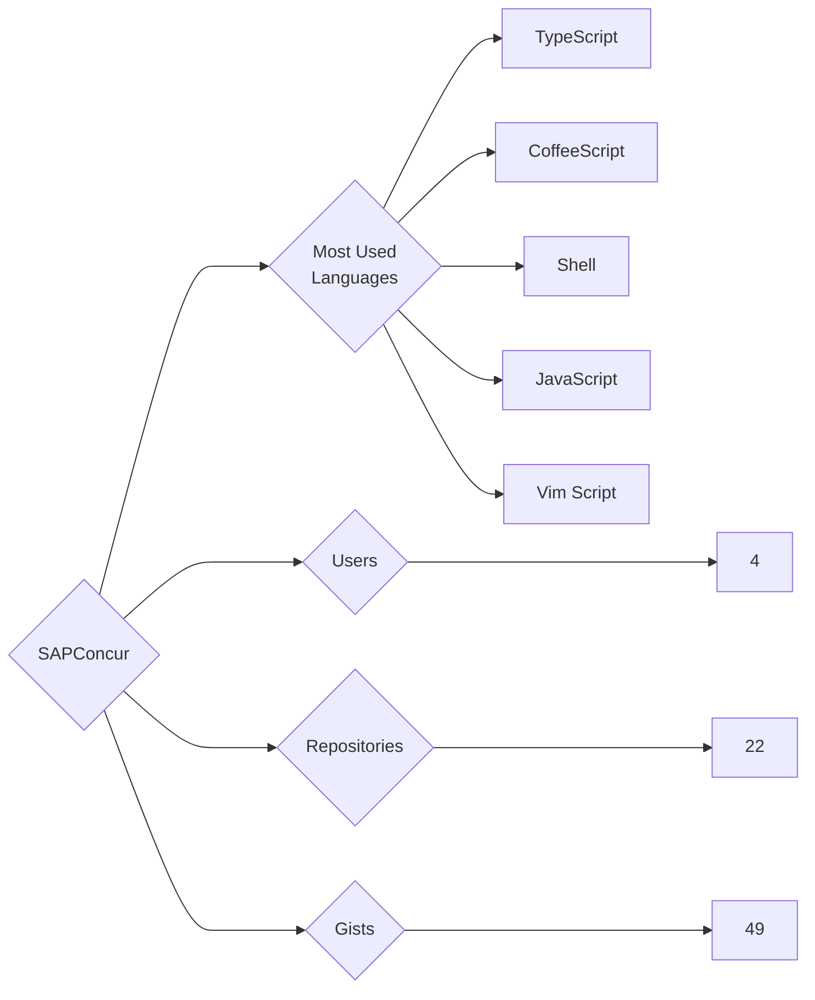

<h1 align="center">SAPConcur</h1>

```mermaid
graph LR
COMPANY_NAME{SAPConcur}
COMPANY_NAME ---> U{Users} ---> UN[4]
COMPANY_NAME ---> R{Repositories} ---> RN[22]
COMPANY_NAME ---> G{Gists} ---> GN[49]
COMPANY_NAME ---> ML{Most Used<br>Languages}
ML --> TypeScript[TypeScript]
ML --> CoffeeScript[CoffeeScript]
ML --> Shell[Shell]
ML --> JavaScript[JavaScript]
ML --> Vim_Script[Vim Script]
```
