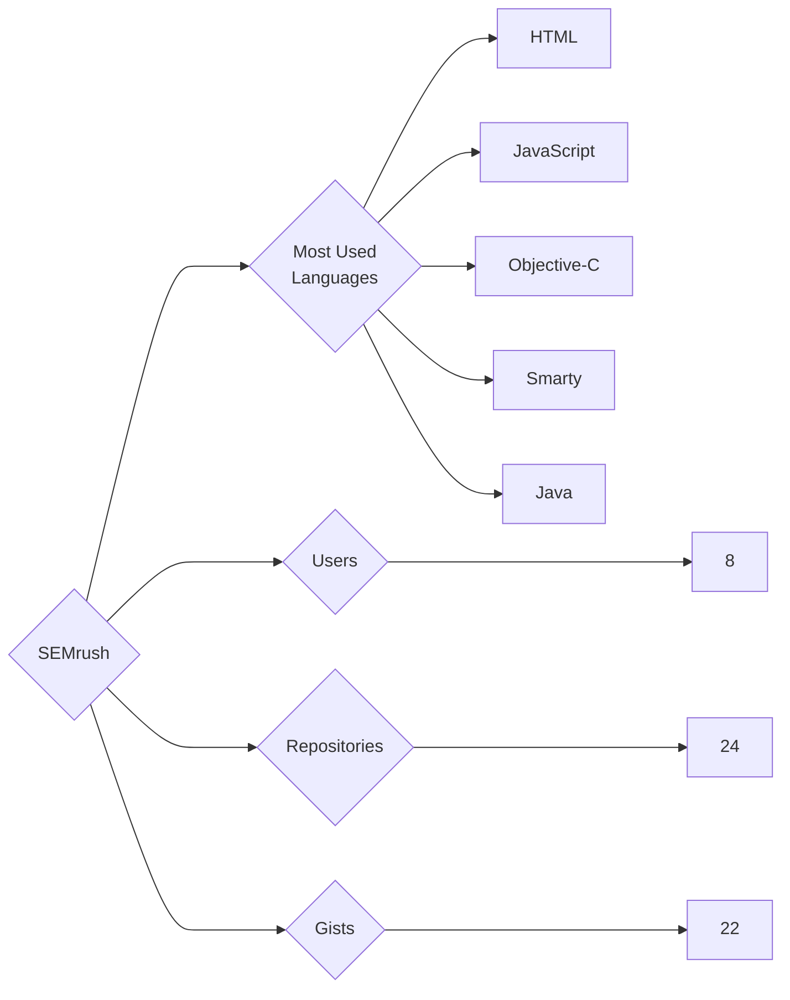

<h1 align="center">SEMrush</h1>

```mermaid
graph LR
COMPANY_NAME{SEMrush}
COMPANY_NAME ---> U{Users} ---> UN[8]
COMPANY_NAME ---> R{Repositories} ---> RN[24]
COMPANY_NAME ---> G{Gists} ---> GN[22]
COMPANY_NAME ---> ML{Most Used<br>Languages}
ML --> HTML[HTML]
ML --> JavaScript[JavaScript]
ML --> Objective-C[Objective-C]
ML --> Smarty[Smarty]
ML --> Java[Java]
```
