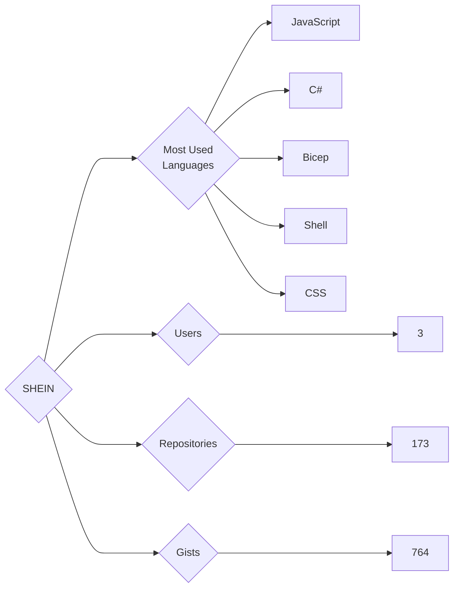

<h1 align="center">SHEIN</h1>

```mermaid
graph LR
COMPANY_NAME{SHEIN}
COMPANY_NAME ---> U{Users} ---> UN[3]
COMPANY_NAME ---> R{Repositories} ---> RN[173]
COMPANY_NAME ---> G{Gists} ---> GN[764]
COMPANY_NAME ---> ML{Most Used<br>Languages}
ML --> JavaScript[JavaScript]
ML --> C#[C#]
ML --> Bicep[Bicep]
ML --> Shell[Shell]
ML --> CSS[CSS]
```
