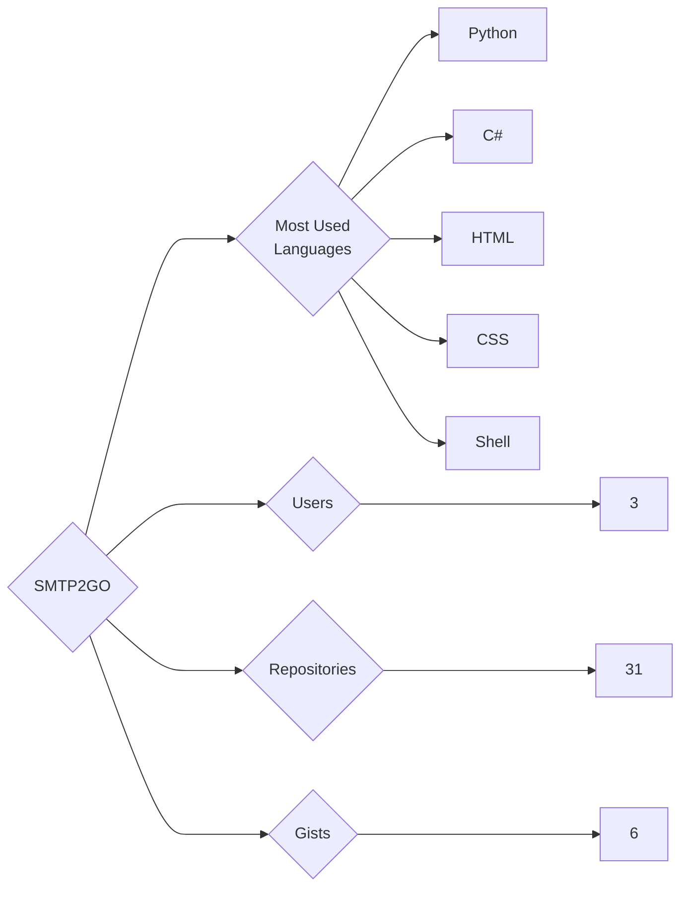

<h1 align="center">SMTP2GO</h1>

```mermaid
graph LR
COMPANY_NAME{SMTP2GO}
COMPANY_NAME ---> U{Users} ---> UN[3]
COMPANY_NAME ---> R{Repositories} ---> RN[31]
COMPANY_NAME ---> G{Gists} ---> GN[6]
COMPANY_NAME ---> ML{Most Used<br>Languages}
ML --> Python[Python]
ML --> C#[C#]
ML --> HTML[HTML]
ML --> CSS[CSS]
ML --> Shell[Shell]
```
