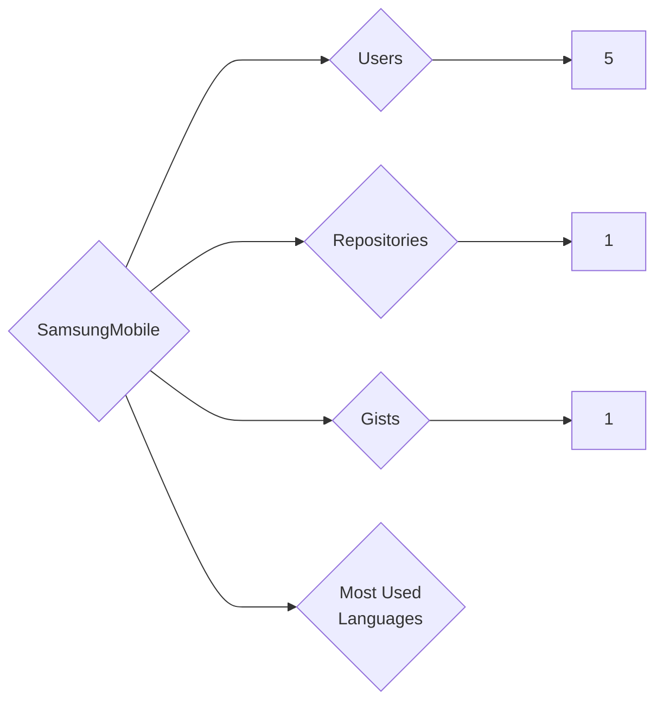

<h1 align="center">SamsungMobile</h1>

```mermaid
graph LR
COMPANY_NAME{SamsungMobile}
COMPANY_NAME ---> U{Users} ---> UN[5]
COMPANY_NAME ---> R{Repositories} ---> RN[1]
COMPANY_NAME ---> G{Gists} ---> GN[1]
COMPANY_NAME ---> ML{Most Used<br>Languages}
```
