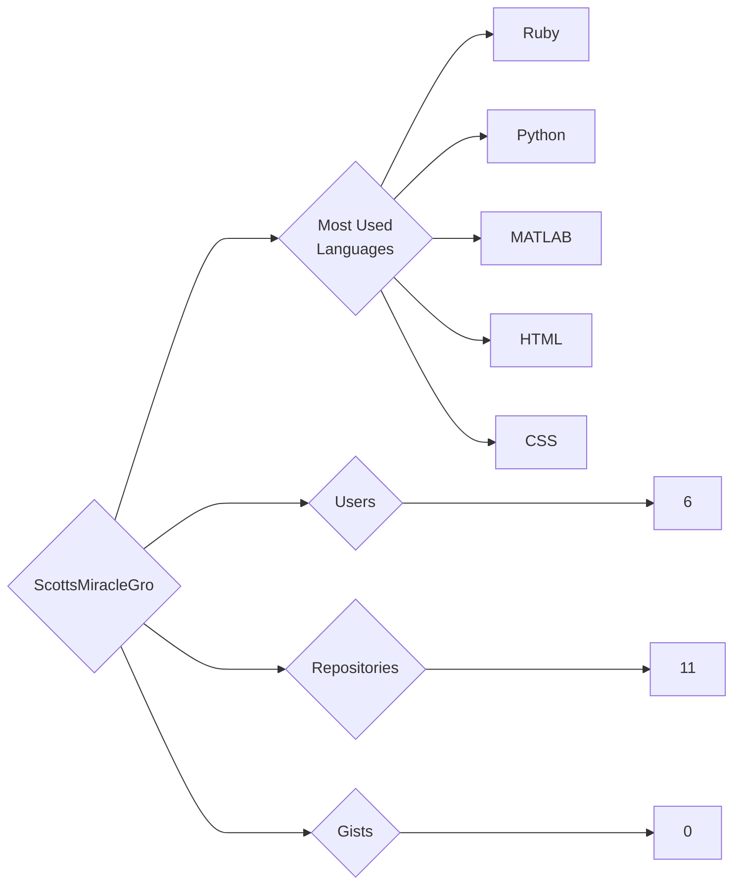

<h1 align="center">ScottsMiracleGro</h1>

```mermaid
graph LR
COMPANY_NAME{ScottsMiracleGro}
COMPANY_NAME ---> U{Users} ---> UN[6]
COMPANY_NAME ---> R{Repositories} ---> RN[11]
COMPANY_NAME ---> G{Gists} ---> GN[0]
COMPANY_NAME ---> ML{Most Used<br>Languages}
ML --> Ruby[Ruby]
ML --> Python[Python]
ML --> MATLAB[MATLAB]
ML --> HTML[HTML]
ML --> CSS[CSS]
```
