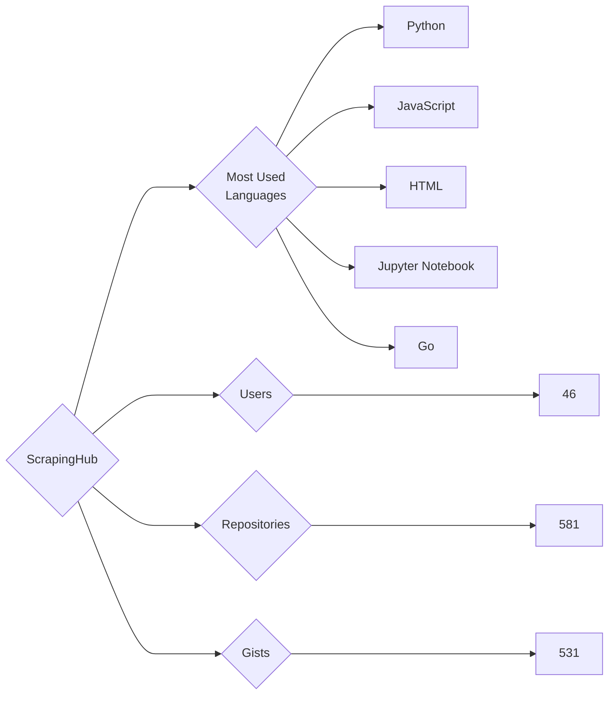

<h1 align="center">ScrapingHub</h1>

```mermaid
graph LR
COMPANY_NAME{ScrapingHub}
COMPANY_NAME ---> U{Users} ---> UN[46]
COMPANY_NAME ---> R{Repositories} ---> RN[581]
COMPANY_NAME ---> G{Gists} ---> GN[531]
COMPANY_NAME ---> ML{Most Used<br>Languages}
ML --> Python[Python]
ML --> JavaScript[JavaScript]
ML --> HTML[HTML]
ML --> Jupyter_Notebook[Jupyter Notebook]
ML --> Go[Go]
```
