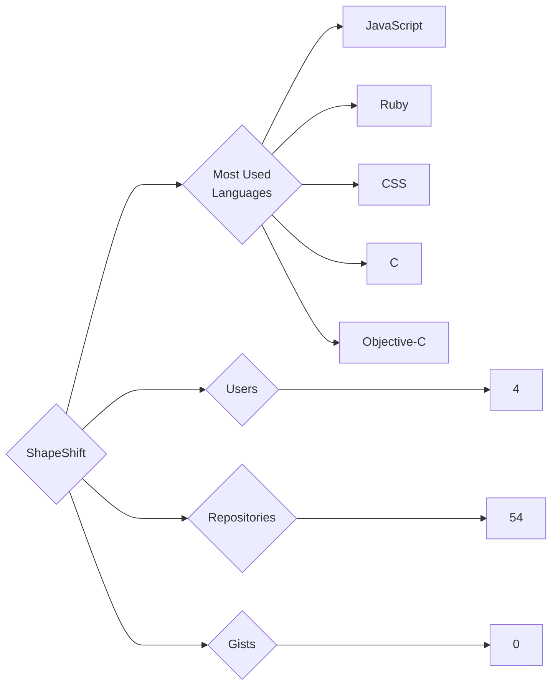

<h1 align="center">ShapeShift</h1>

```mermaid
graph LR
COMPANY_NAME{ShapeShift}
COMPANY_NAME ---> U{Users} ---> UN[4]
COMPANY_NAME ---> R{Repositories} ---> RN[54]
COMPANY_NAME ---> G{Gists} ---> GN[0]
COMPANY_NAME ---> ML{Most Used<br>Languages}
ML --> JavaScript[JavaScript]
ML --> Ruby[Ruby]
ML --> CSS[CSS]
ML --> C[C]
ML --> Objective-C[Objective-C]
```
