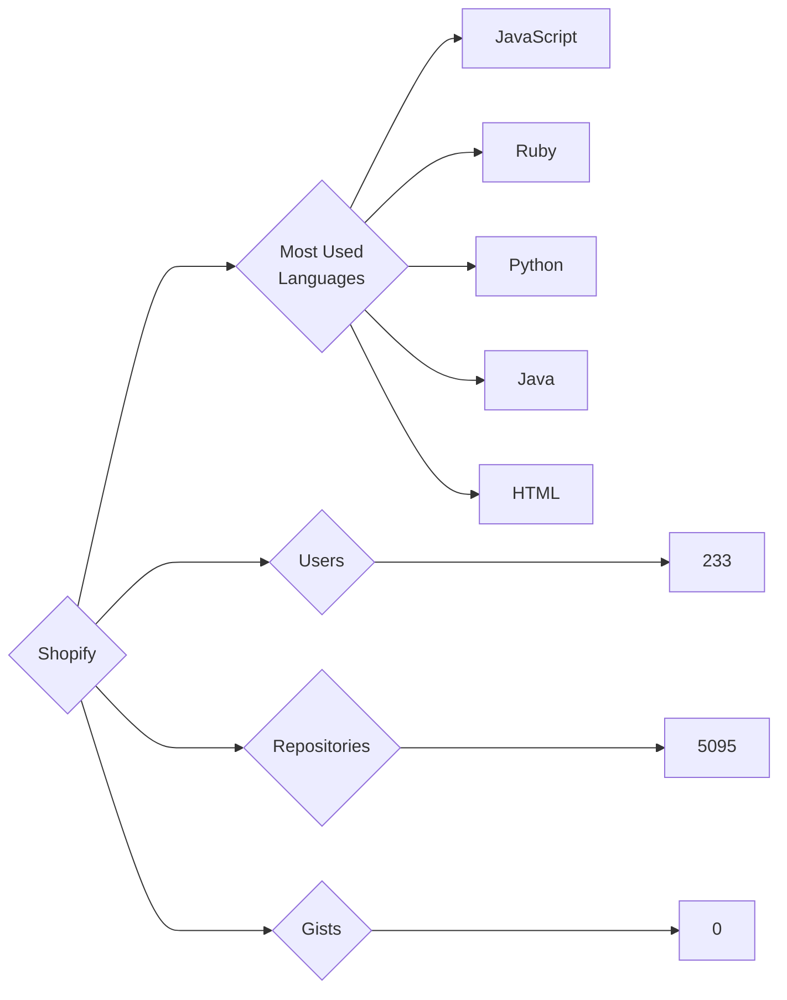

<h1 align="center">Shopify</h1>

```mermaid
graph LR
COMPANY_NAME{Shopify}
COMPANY_NAME ---> U{Users} ---> UN[233]
COMPANY_NAME ---> R{Repositories} ---> RN[5095]
COMPANY_NAME ---> G{Gists} ---> GN[0]
COMPANY_NAME ---> ML{Most Used<br>Languages}
ML --> JavaScript
ML --> Ruby
ML --> Python
ML --> Java
ML --> HTML
```
