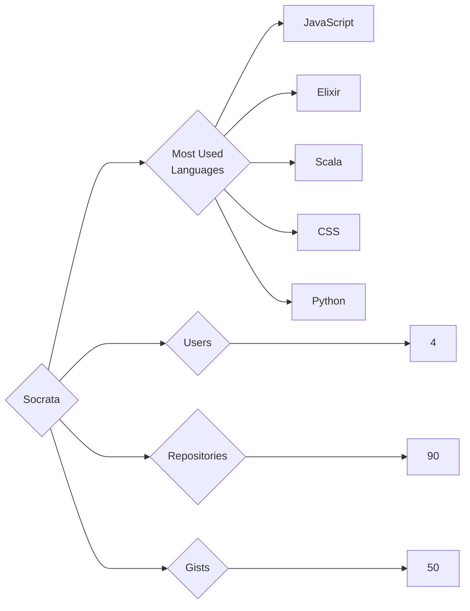

<h1 align="center">Socrata</h1>

```mermaid
graph LR
COMPANY_NAME{Socrata}
COMPANY_NAME ---> U{Users} ---> UN[4]
COMPANY_NAME ---> R{Repositories} ---> RN[90]
COMPANY_NAME ---> G{Gists} ---> GN[50]
COMPANY_NAME ---> ML{Most Used<br>Languages}
ML --> JavaScript[JavaScript]
ML --> Elixir[Elixir]
ML --> Scala[Scala]
ML --> CSS[CSS]
ML --> Python[Python]
```
