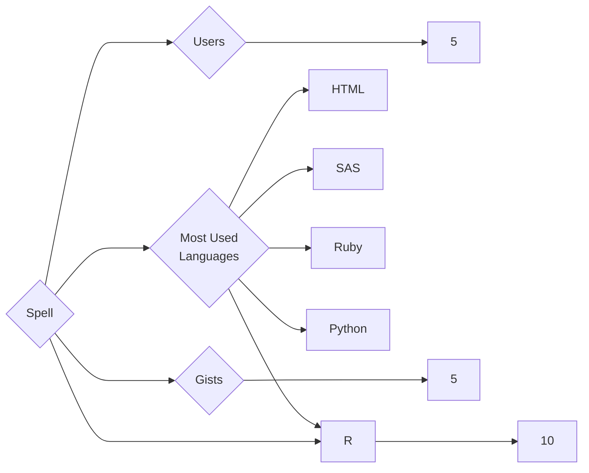

<h1 align="center">Spell</h1>

```mermaid
graph LR
COMPANY_NAME{Spell}
COMPANY_NAME ---> U{Users} ---> UN[5]
COMPANY_NAME ---> R{Repositories} ---> RN[10]
COMPANY_NAME ---> G{Gists} ---> GN[5]
COMPANY_NAME ---> ML{Most Used<br>Languages}
ML --> HTML[HTML]
ML --> R[R]
ML --> SAS[SAS]
ML --> Ruby[Ruby]
ML --> Python[Python]
```
