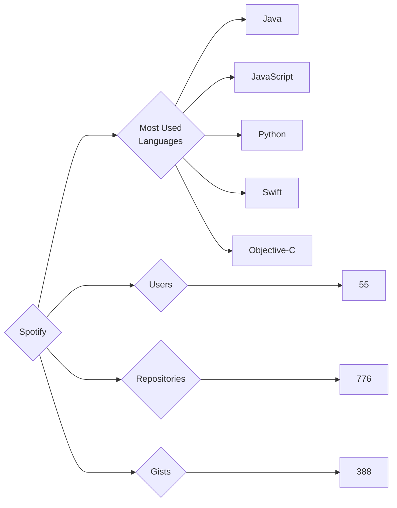

<h1 align="center">Spotify</h1>

```mermaid
graph LR
COMPANY_NAME{Spotify}
COMPANY_NAME ---> U{Users} ---> UN[55]
COMPANY_NAME ---> R{Repositories} ---> RN[776]
COMPANY_NAME ---> G{Gists} ---> GN[388]
COMPANY_NAME ---> ML{Most Used<br>Languages}
ML --> Java[Java]
ML --> JavaScript[JavaScript]
ML --> Python[Python]
ML --> Swift[Swift]
ML --> Objective-C[Objective-C]
```
