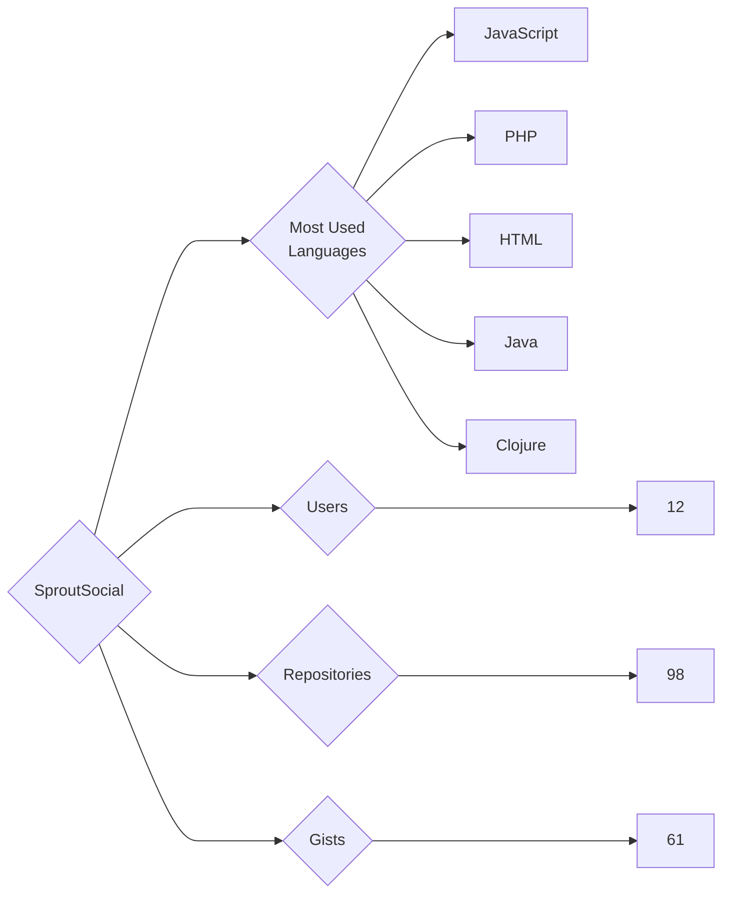

<h1 align="center">SproutSocial</h1>

```mermaid
graph LR
COMPANY_NAME{SproutSocial}
COMPANY_NAME ---> U{Users} ---> UN[12]
COMPANY_NAME ---> R{Repositories} ---> RN[98]
COMPANY_NAME ---> G{Gists} ---> GN[61]
COMPANY_NAME ---> ML{Most Used<br>Languages}
ML --> JavaScript[JavaScript]
ML --> PHP[PHP]
ML --> HTML[HTML]
ML --> Java[Java]
ML --> Clojure[Clojure]
```
