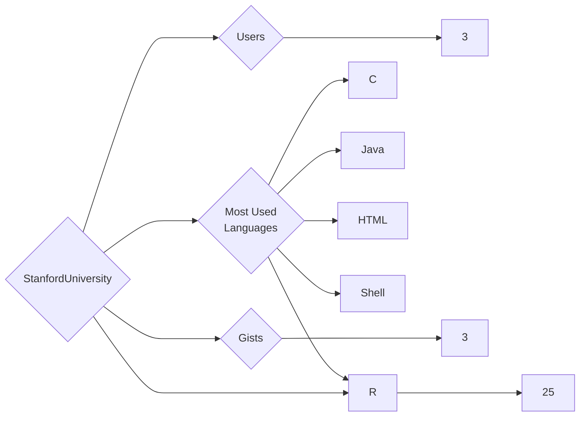

<h1 align="center">StanfordUniversity</h1>

```mermaid
graph LR
COMPANY_NAME{StanfordUniversity}
COMPANY_NAME ---> U{Users} ---> UN[3]
COMPANY_NAME ---> R{Repositories} ---> RN[25]
COMPANY_NAME ---> G{Gists} ---> GN[3]
COMPANY_NAME ---> ML{Most Used<br>Languages}
ML --> C[C]
ML --> Java[Java]
ML --> HTML[HTML]
ML --> R[R]
ML --> Shell[Shell]
```
