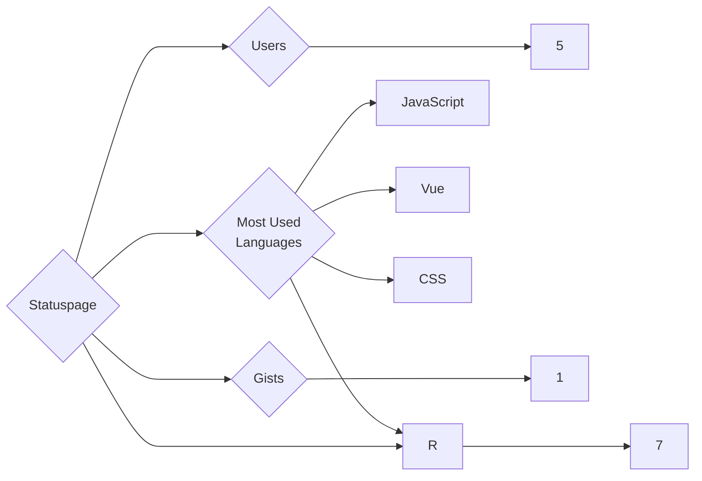

<h1 align="center">Statuspage</h1>

```mermaid
graph LR
COMPANY_NAME{Statuspage}
COMPANY_NAME ---> U{Users} ---> UN[5]
COMPANY_NAME ---> R{Repositories} ---> RN[7]
COMPANY_NAME ---> G{Gists} ---> GN[1]
COMPANY_NAME ---> ML{Most Used<br>Languages}
ML --> JavaScript[JavaScript]
ML --> Vue[Vue]
ML --> R[R]
ML --> CSS[CSS]
```
