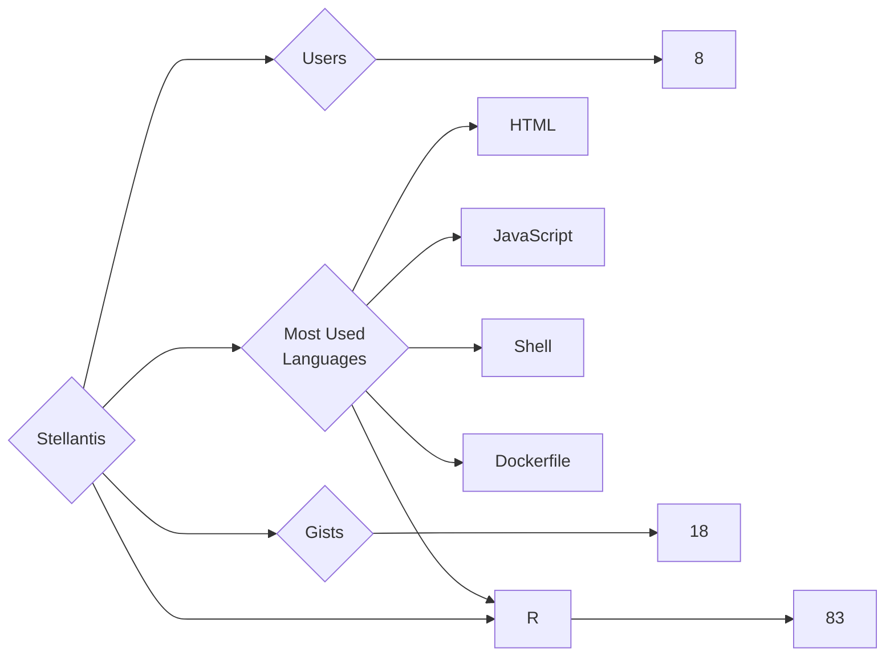

<h1 align="center">Stellantis</h1>

```mermaid
graph LR
COMPANY_NAME{Stellantis}
COMPANY_NAME ---> U{Users} ---> UN[8]
COMPANY_NAME ---> R{Repositories} ---> RN[83]
COMPANY_NAME ---> G{Gists} ---> GN[18]
COMPANY_NAME ---> ML{Most Used<br>Languages}
ML --> HTML[HTML]
ML --> JavaScript[JavaScript]
ML --> R[R]
ML --> Shell[Shell]
ML --> Dockerfile[Dockerfile]
```
