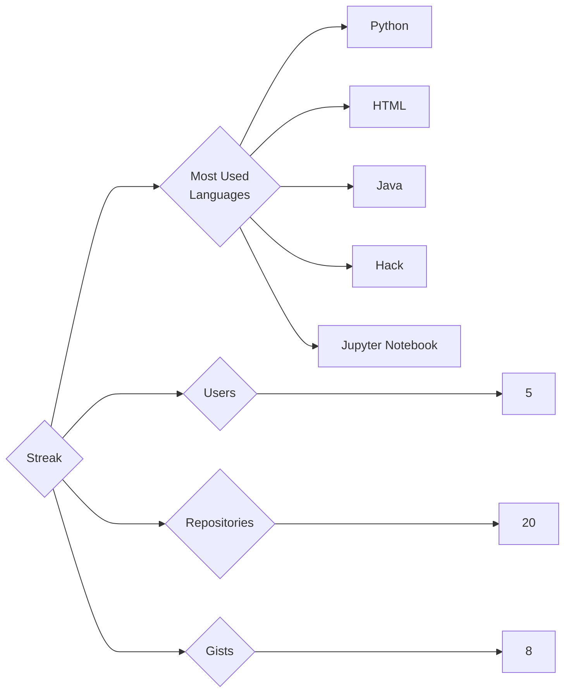

<h1 align="center">Streak</h1>

```mermaid
graph LR
COMPANY_NAME{Streak}
COMPANY_NAME ---> U{Users} ---> UN[5]
COMPANY_NAME ---> R{Repositories} ---> RN[20]
COMPANY_NAME ---> G{Gists} ---> GN[8]
COMPANY_NAME ---> ML{Most Used<br>Languages}
ML --> Python[Python]
ML --> HTML[HTML]
ML --> Java[Java]
ML --> Hack[Hack]
ML --> Jupyter_Notebook[Jupyter Notebook]
```
