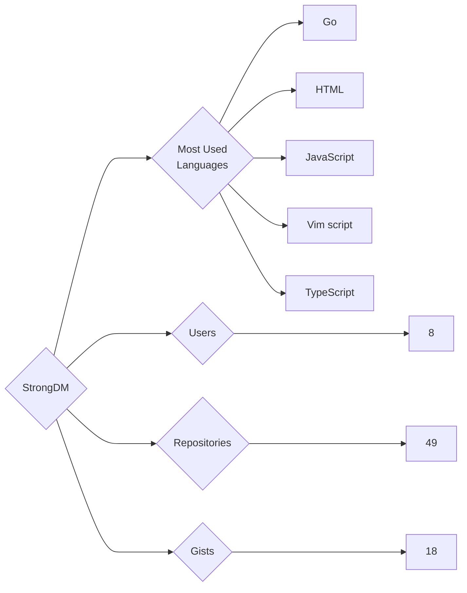

<h1 align="center">StrongDM</h1>

```mermaid
graph LR
COMPANY_NAME{StrongDM}
COMPANY_NAME ---> U{Users} ---> UN[8]
COMPANY_NAME ---> R{Repositories} ---> RN[49]
COMPANY_NAME ---> G{Gists} ---> GN[18]
COMPANY_NAME ---> ML{Most Used<br>Languages}
ML --> Go[Go]
ML --> HTML[HTML]
ML --> JavaScript[JavaScript]
ML --> Vim_script[Vim script]
ML --> TypeScript[TypeScript]
```
