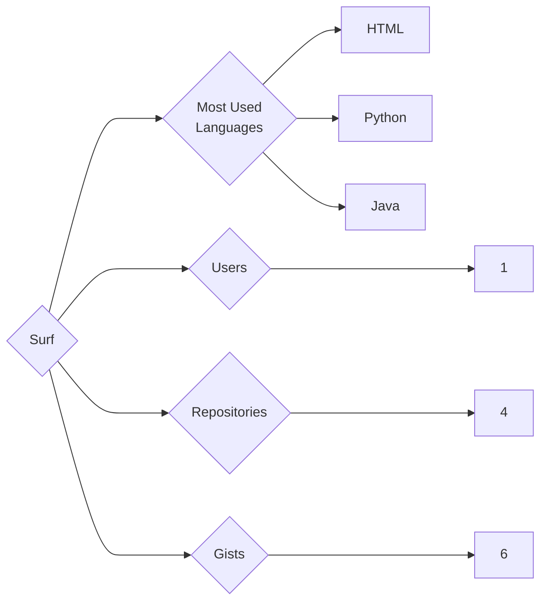

<h1 align="center">Surf</h1>

```mermaid
graph LR
COMPANY_NAME{Surf}
COMPANY_NAME ---> U{Users} ---> UN[1]
COMPANY_NAME ---> R{Repositories} ---> RN[4]
COMPANY_NAME ---> G{Gists} ---> GN[6]
COMPANY_NAME ---> ML{Most Used<br>Languages}
ML --> HTML[HTML]
ML --> Python[Python]
ML --> Java[Java]
```
