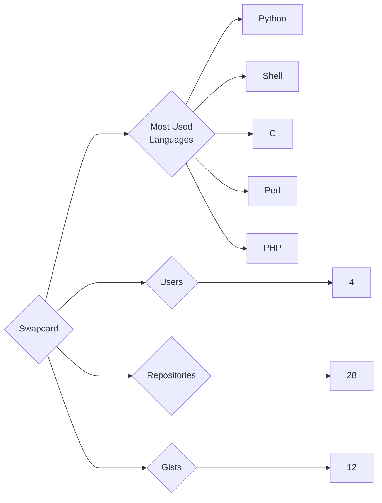

<h1 align="center">Swapcard</h1>

```mermaid
graph LR
COMPANY_NAME{Swapcard}
COMPANY_NAME ---> U{Users} ---> UN[4]
COMPANY_NAME ---> R{Repositories} ---> RN[28]
COMPANY_NAME ---> G{Gists} ---> GN[12]
COMPANY_NAME ---> ML{Most Used<br>Languages}
ML --> Python[Python]
ML --> Shell[Shell]
ML --> C[C]
ML --> Perl[Perl]
ML --> PHP[PHP]
```
