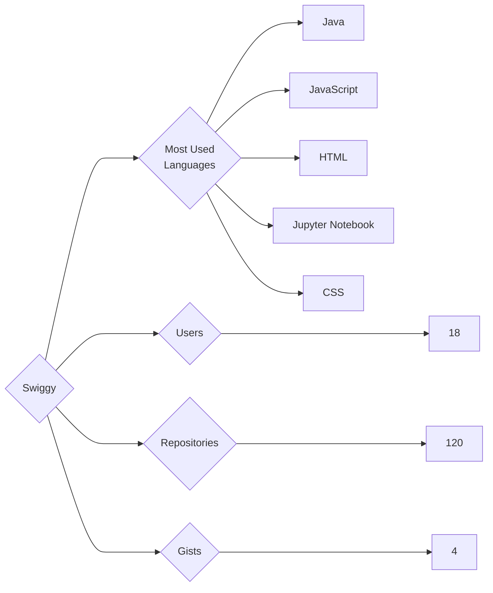

<h1 align="center">Swiggy</h1>

```mermaid
graph LR
COMPANY_NAME{Swiggy}
COMPANY_NAME ---> U{Users} ---> UN[18]
COMPANY_NAME ---> R{Repositories} ---> RN[120]
COMPANY_NAME ---> G{Gists} ---> GN[4]
COMPANY_NAME ---> ML{Most Used<br>Languages}
ML --> Java[Java]
ML --> JavaScript[JavaScript]
ML --> HTML[HTML]
ML --> Jupyter_Notebook[Jupyter Notebook]
ML --> CSS[CSS]
```
