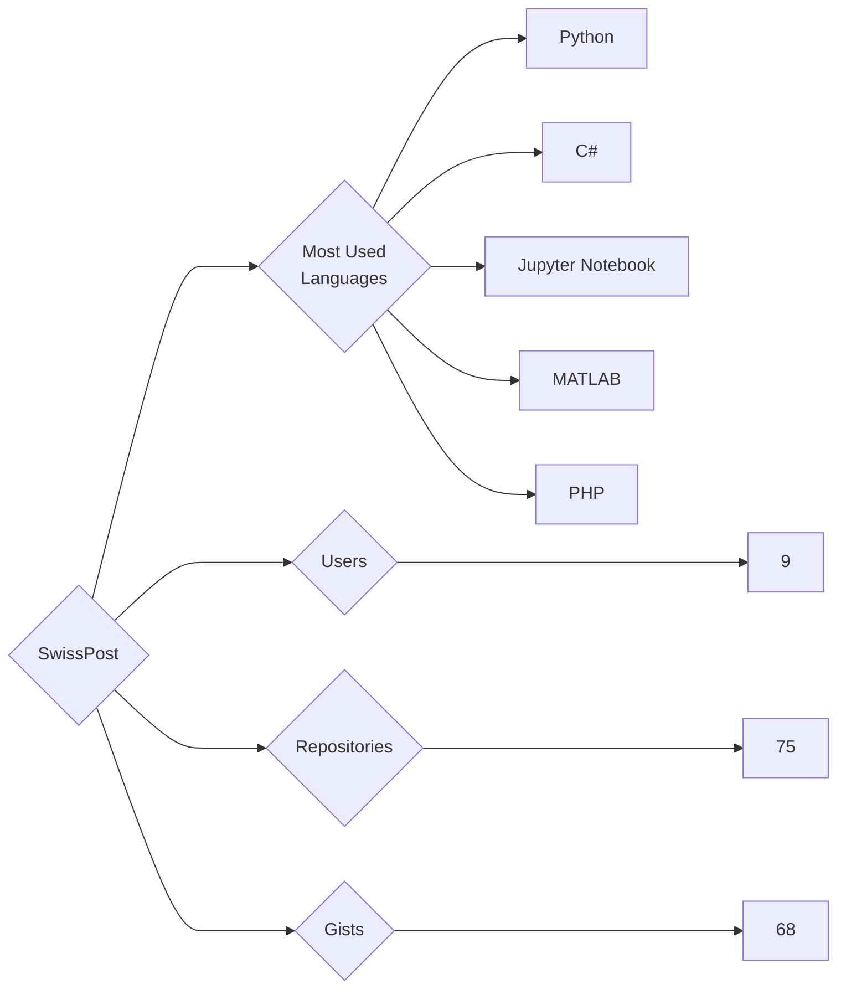

<h1 align="center">SwissPost</h1>

```mermaid
graph LR
COMPANY_NAME{SwissPost}
COMPANY_NAME ---> U{Users} ---> UN[9]
COMPANY_NAME ---> R{Repositories} ---> RN[75]
COMPANY_NAME ---> G{Gists} ---> GN[68]
COMPANY_NAME ---> ML{Most Used<br>Languages}
ML --> Python[Python]
ML --> C#[C#]
ML --> Jupyter_Notebook[Jupyter Notebook]
ML --> MATLAB[MATLAB]
ML --> PHP[PHP]
```
