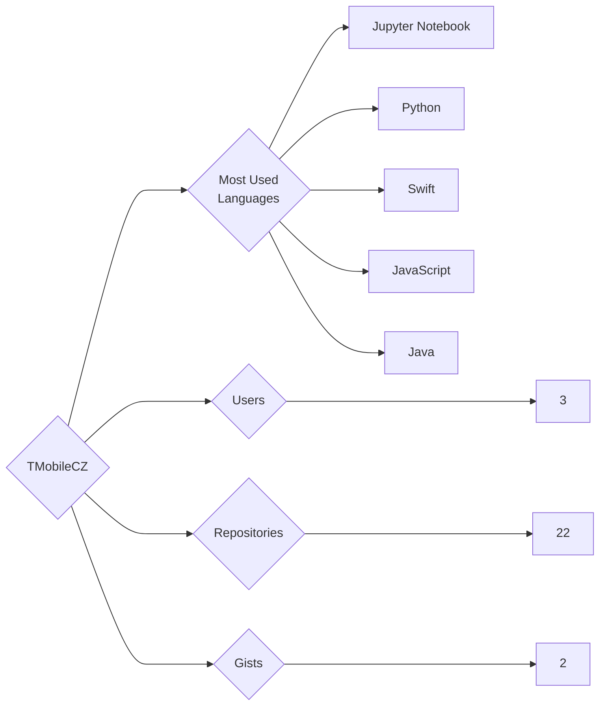

<h1 align="center">TMobileCZ</h1>

```mermaid
graph LR
COMPANY_NAME{TMobileCZ}
COMPANY_NAME ---> U{Users} ---> UN[3]
COMPANY_NAME ---> R{Repositories} ---> RN[22]
COMPANY_NAME ---> G{Gists} ---> GN[2]
COMPANY_NAME ---> ML{Most Used<br>Languages}
ML --> Jupyter_Notebook[Jupyter Notebook]
ML --> Python[Python]
ML --> Swift[Swift]
ML --> JavaScript[JavaScript]
ML --> Java[Java]
```
