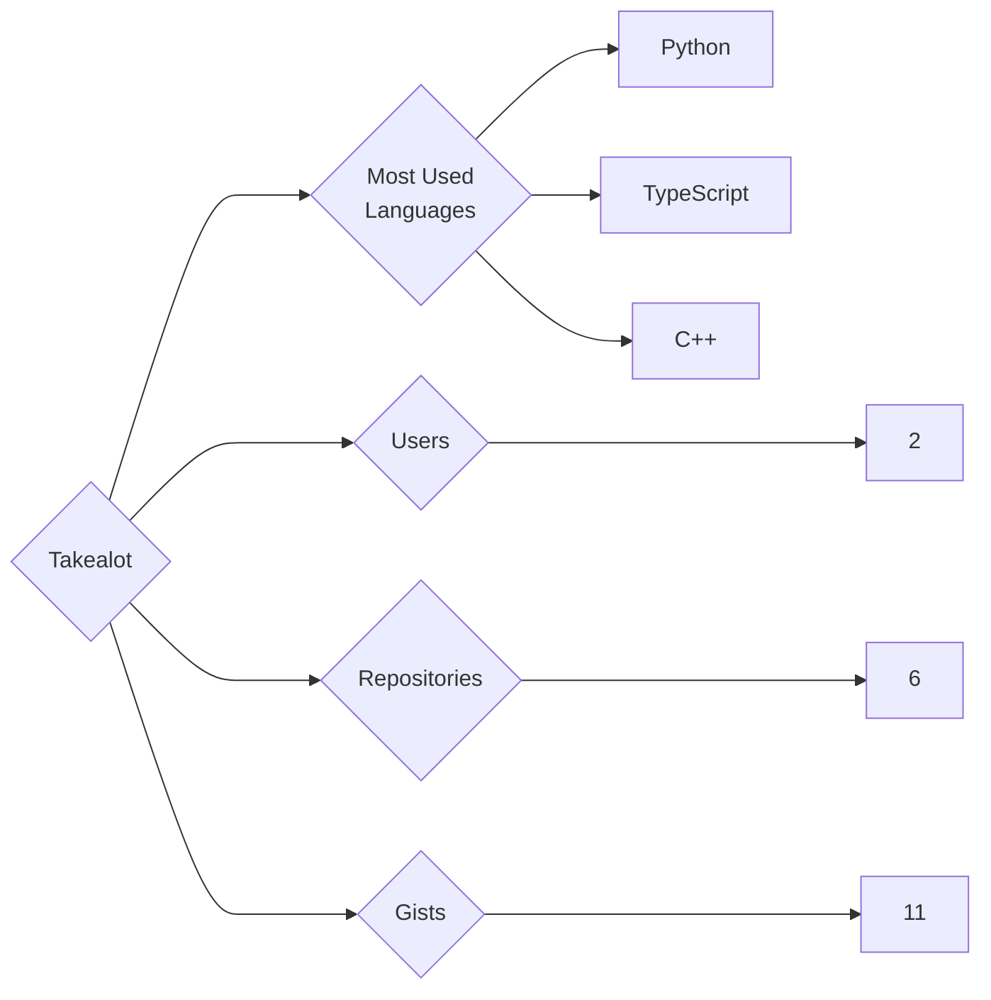

<h1 align="center">Takealot</h1>

```mermaid
graph LR
COMPANY_NAME{Takealot}
COMPANY_NAME ---> U{Users} ---> UN[2]
COMPANY_NAME ---> R{Repositories} ---> RN[6]
COMPANY_NAME ---> G{Gists} ---> GN[11]
COMPANY_NAME ---> ML{Most Used<br>Languages}
ML --> Python[Python]
ML --> TypeScript[TypeScript]
ML --> C++[C++]
```
