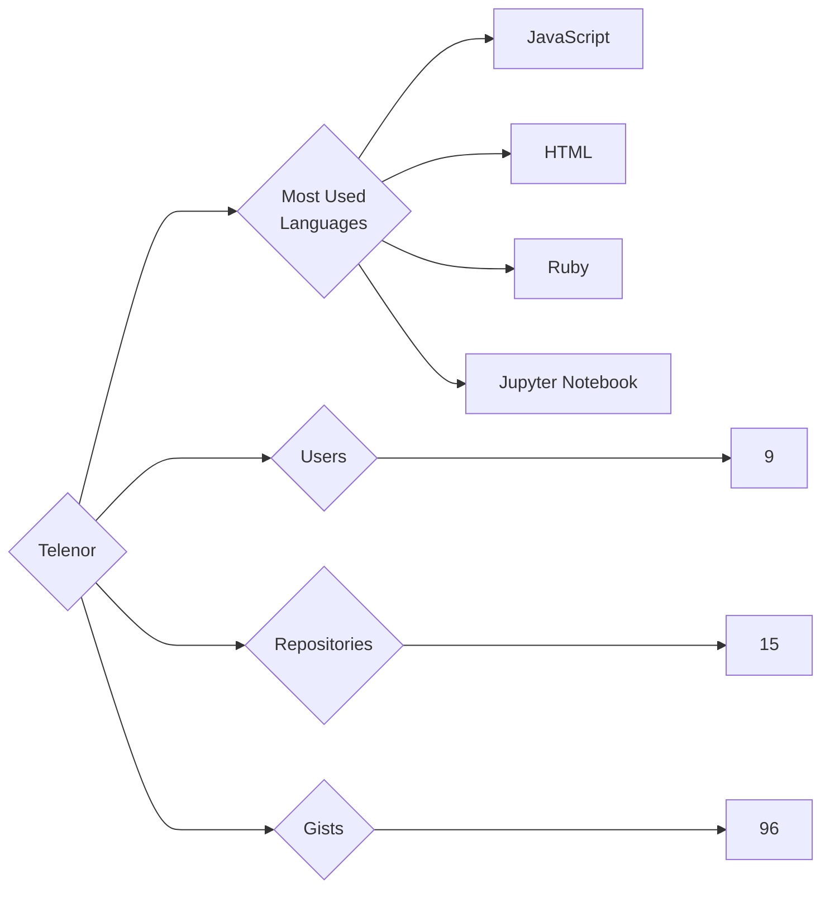

<h1 align="center">Telenor</h1>

```mermaid
graph LR
COMPANY_NAME{Telenor}
COMPANY_NAME ---> U{Users} ---> UN[9]
COMPANY_NAME ---> R{Repositories} ---> RN[15]
COMPANY_NAME ---> G{Gists} ---> GN[96]
COMPANY_NAME ---> ML{Most Used<br>Languages}
ML --> JavaScript[JavaScript]
ML --> HTML[HTML]
ML --> Ruby[Ruby]
ML --> Jupyter_Notebook[Jupyter Notebook]
```
