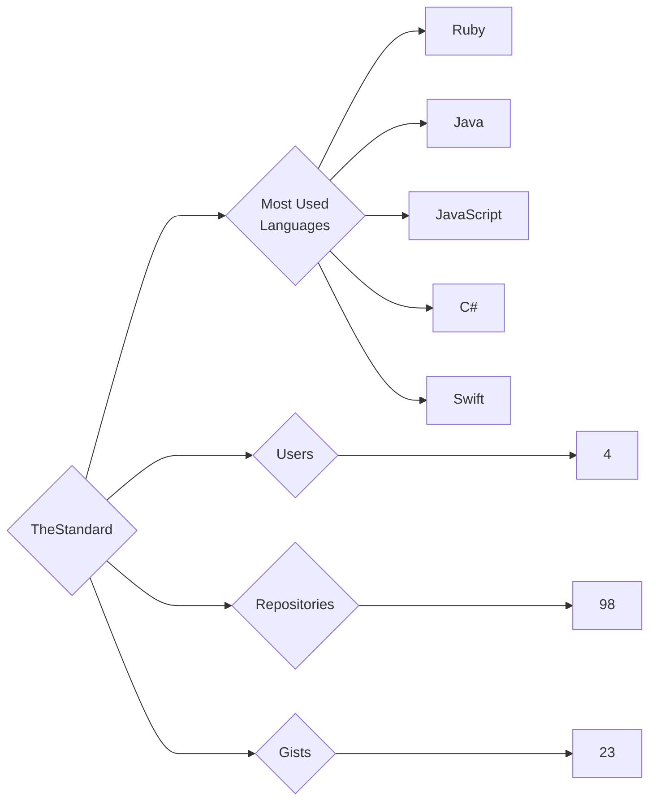

<h1 align="center">TheStandard</h1>

```mermaid
graph LR
COMPANY_NAME{TheStandard}
COMPANY_NAME ---> U{Users} ---> UN[4]
COMPANY_NAME ---> R{Repositories} ---> RN[98]
COMPANY_NAME ---> G{Gists} ---> GN[23]
COMPANY_NAME ---> ML{Most Used<br>Languages}
ML --> Ruby[Ruby]
ML --> Java[Java]
ML --> JavaScript[JavaScript]
ML --> C#[C#]
ML --> Swift[Swift]
```
