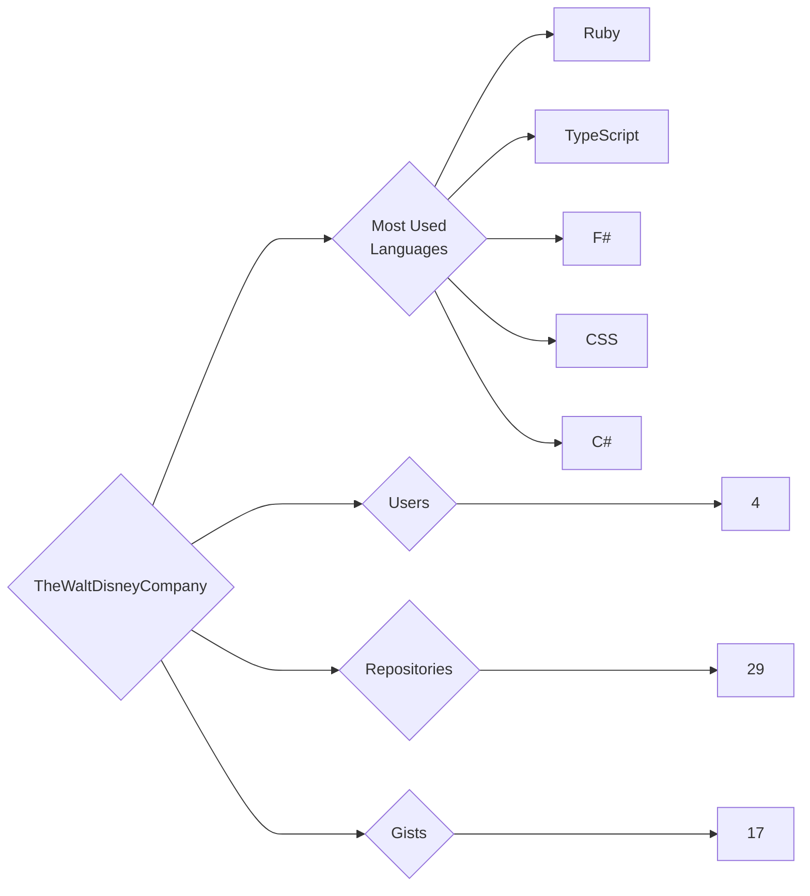

<h1 align="center">TheWaltDisneyCompany</h1>

```mermaid
graph LR
COMPANY_NAME{TheWaltDisneyCompany}
COMPANY_NAME ---> U{Users} ---> UN[4]
COMPANY_NAME ---> R{Repositories} ---> RN[29]
COMPANY_NAME ---> G{Gists} ---> GN[17]
COMPANY_NAME ---> ML{Most Used<br>Languages}
ML --> Ruby[Ruby]
ML --> TypeScript[TypeScript]
ML --> F#[F#]
ML --> CSS[CSS]
ML --> C#[C#]
```
