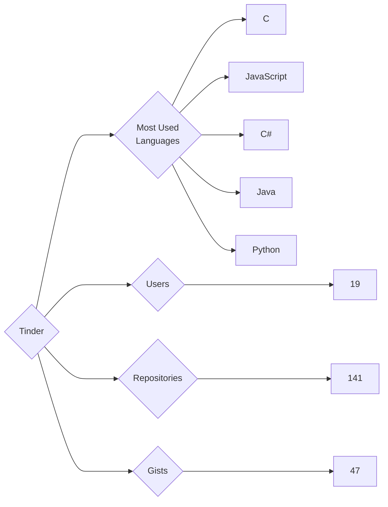

<h1 align="center">Tinder</h1>

```mermaid
graph LR
COMPANY_NAME{Tinder}
COMPANY_NAME ---> U{Users} ---> UN[19]
COMPANY_NAME ---> R{Repositories} ---> RN[141]
COMPANY_NAME ---> G{Gists} ---> GN[47]
COMPANY_NAME ---> ML{Most Used<br>Languages}
ML --> C[C]
ML --> JavaScript[JavaScript]
ML --> C#[C#]
ML --> Java[Java]
ML --> Python[Python]
```
